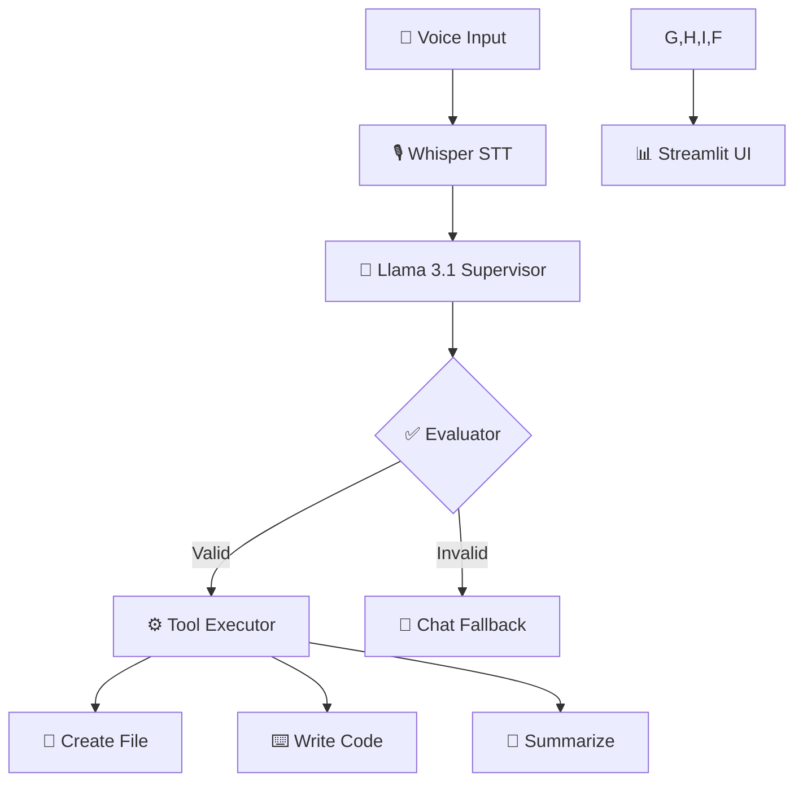

# 🎙️ Memo AI: Building a Multi-Agent Local Voice Assistant

## 🚀 Overview

**Memo AI** is a fully local, voice-controlled AI agent designed to execute complex tasks—from code generation to file management—directly on your machine. By leveraging state-of-the-art open-source models like **Whisper** and **Llama 3**, it provides a private, fast, and highly capable assistant without the need for cloud APIs.

---

## 🏗️ System Architecture

Memo AI follows a modular, pipeline-based architecture designed for reliability and speed:

1.  **Speech-to-Text (STT)**: Uses `openai/whisper-base` (via Faster-Whisper) to convert audio input (microphone or file) into high-accuracy text.
2.  **Supervisor (Llama 3.1)**: A logic-heavy agent that analyzes the transcription and classifies it into one or more specific intents (Compound Commands).
3.  **Evaluator**: A validation layer that ensures the LLM's structured output (JSON) is valid and safe before execution.
4.  **Agents & Tools (Llama 3.2)**: Specialized workers that perform actual tasks like writing Python code, summarizing text, or chatting.
5.  **UI (Streamlit)**: A sleek, glassmorphism-inspired dashboard that provides real-time feedback, benchmarks, and "Human-in-the-Loop" safety checks.

---

## 🧠 Model Strategy: Hybrid Resource Allocation

One of the unique features of Memo AI is how it balances system resources by splitting tasks between the CPU and GPU:

### 1. Llama 3.1 8B (Supervisor / CPU)
*   **Role**: Supervision, Intent Classification, and Evaluation.
*   **Hardware**: Runs on the **CPU**.
*   **Rationale**: The 8B model is highly capable at logic and instruction-following. By running it on the CPU, we reserve the precious VRAM for the latency-sensitive generation tasks, ensuring that the heavy thinking doesn't bottleneck the GPU.

### 2. Llama 3.2 3B (Agents / GPU)
*   **Role**: Tool Execution, Code Generation, and Streaming Chat.
*   **Hardware**: Uses the **GPU** for maximum performance.
*   **Rationale**: The 3B model is exceptionally fast. Running it on the GPU allows for near-instant code generation and smooth, high-token-per-second chat streaming, providing a "snappy" user experience.

---

## 🛠️ Lessons Learned: Challenges & Solutions

During development, we encountered and solved several critical engineering hurdles:

### 1. The "Connection Refused" Error
**Problem**: Users would encounter a cryptic `httpx.ConnectError` if the Ollama background service wasn't running or was still warming up.
**Solution**: We implemented a robust error-handling wrapper in `llm_client.py`. Now, instead of crashing, the app detects the connection failure and provides a beautiful, user-friendly alert in the UI, instructing the user to start Ollama.

### 2. The Human-in-the-Loop Execution Bug
**Problem**: In the initial "Human-in-the-Loop" implementation, the execution flow would often hang or skip tasks after the user clicked "Confirm." This was due to complex session state management in Streamlit where variables were being overwritten before the tool could finish.
**Solution**: We refactored the `pending_confirmation` logic to store the entire `result_bundle` in the session state. This ensured that even across UI reruns, the agent remembered exactly which intents were approved and what transcription they belonged to, creating a seamless confirmation-to-execution flow.

### 3. Supporting Compound Commands
**Problem**: Initially, the agent could only handle one task at a time (e.g., "Summarize this").
**Solution**: We upgraded the **Supervisor's System Prompt** to return an array of intents. We then adapted the tool executor to iterate through these tasks sequentially, passing context (like a summary result) from one tool to the next using placeholder replacement (e.g., `SUMMARY_PLACEHOLDER`).

---

## 📊 Real-Time Benchmarking

To help users optimize their setup, we added a **Model Benchmark** section in the sidebar. This tracks:
*   **STT Latency**: How fast your CPU/GPU transcribes.
*   **Intent Latency**: Llama 3.1's reasoning speed on CPU.
*   **Tool Latency**: Llama 3.2's generation speed on GPU.

This level of transparency allows developers to see exactly where the bottlenecks are and swap models to find their "sweet spot" for performance.

---

*Developed for the Mem0 AI & Generative AI Developer Internship Assignment.*
